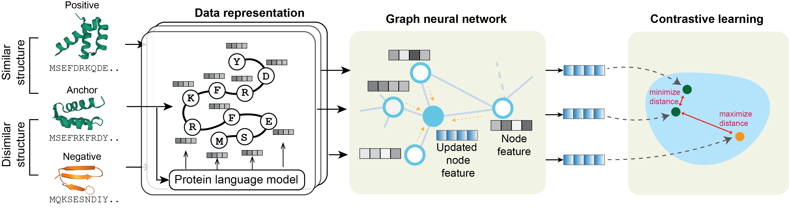

# PenLight
This is the official repository for **Contrastive learning of protein representations with graph neural networks for structural and functional annotations**[[link](https://doi.org/10.1142/9789811270611_0011)]. Compared to our original implementation, this branch has an optimized code structure and supports multilabel training and inference for EC number predictions.
- [PenLight](#penlight)
  - [Overview](#overview)
  - [Requirements](#requirements)
  - [Datasets](#datasets)
  - [Training](#training)
  - [Prediction](#prediction)
  - [Citation](#citation)
  - [Contact](#contact)

## Overview


## Requirements
- pytorch
- torch_geometric
- torch_cluster
- torch_scatter
- biopython
- sklearn
- matplotlib
- seaborn
- numpy

## Datasets
### CATH Dataset
All datasets used in this project are in json format. Each json file contains a dictionary like this: `{"id": {"ec"/"cath": [1.1.1.1], "coordinates": {"N": [], "CA": [], "C": [], "O": []}, "seq": "MKIRSQ..."}}`. 

For CATH prediction, we followed the data split method from [ProtTucker](https://www.biorxiv.org/content/10.1101/2021.11.14.468528v1). Our CATH dataset can be downloaded from [Google Drive](https://drive.google.com/file/d/1QtNKcaGM6opncR6_y-ZPwG7kcPIOaAVx/view?usp=sharing)

### EC Dataset
For EC number prediction, we used the dataset from [DeepFRI](https://www.nature.com/articles/s41467-021-23303-9).

Our EC dataset can be downloaded from [Google Drive](https://drive.google.com/file/d/1Bh0S9EiqSyaNMU5SFHTpy6LcN2k6rq6P/view?usp=sharing).

## Training
We use yml files to store training configurations. To train a new model from scratch, you can use the following cammand:
```
python train.py --config log/demo/config.yml
```
You can use `python train.py -h` to get the details about the configuration parameters.

## Prediction
To make predictions using pretrained models, you can use the following command: 
```
python predict.py --config config_file --model model_checkpoint --lookupset lookupset --input input_dataset_file --output results.json
```
The config file should be the same file used for training the model checkpoint.

## Citation
>Luo J, Luo Y. Contrastive learning of protein representations with graph neural networks for structural and functional annotations[C]//PACIFIC SYMPOSIUM ON BIOCOMPUTING 2023: Kohala Coast, Hawaii, USA, 3–7 January 2023. 2022: 109-120. https://doi.org/10.1142/9789811270611_0011
```
@inproceedings{luo2022contrastive,
  title={Contrastive learning of protein representations with graph neural networks for structural and functional annotations},
  author={Luo, Jiaqi and Luo, Yunan},
  booktitle={PACIFIC SYMPOSIUM ON BIOCOMPUTING 2023: Kohala Coast, Hawaii, USA, 3--7 January 2023},
  pages={109--120},
  year={2022},
  organization={World Scientific}
}
```

## Contact
Please submit GitHub issues or contact Jiaqi Luo (luojiaqi2019@gmail.com) for any questions related to the source code.